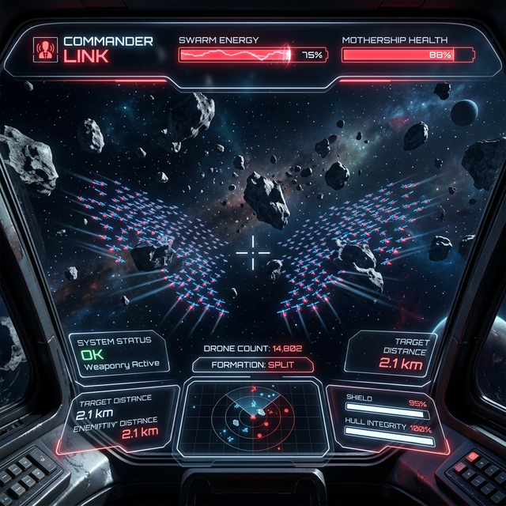

# 🌌 SwarmGame: Commander's Link

[](https://opensource.org/licenses/MIT)
[](https://www.python.org/downloads/)
[](https://pnpm.io/)

> **“指挥官，蜂群已就绪，等待您的指令。”**

SwarmGame 是一款沉浸式网页 3D 战斗游戏，结合了 **MediaPipe 手势识别** 与 **Faster-Whisper 语音识别**。玩家将扮演指挥官，在 16G 内存的 Mac 环境下，通过真实的手势与语音指令操纵 4000 架无人机组成的蜂群，在限时内摧毁陨石带并终结外星母星。

---


## ✨ 核心特性

- **🚀 蜂群指挥系统**：基于 **Boids 算法** 的高效群组模拟，支持 4000+ 动态单位在 3D 空间内流畅运行。
- **🧠 边缘侧 AI 交互**：
  - **语音指令**：采用 `Faster-Whisper` (Tiny.en/zh int8)，识别“出发”、“攻击”、“躲避”等即时指令。
  - **手势追踪**：采用 `MediaPipe Hands`，实现五指张开（OVERLOAD）与双手分离（SPLIT）等操作。
- **🎮 视觉与音效**：
  - **3D 准星系统**：定制化红色 BoxGeometry 准星，解决多视角深度消失问题。
  - **动态背景音**：随战斗节奏激昂的 8-bit 复古 BGM 与激光音效。
- **💻 极致优化**：专为 Mac 16G 内存优化，感知层与渲染层异步分离。

## 📸 游戏截图



## 🛠️ 技术栈与 AI 模型

### 感知层 (AI Hub)
- **语音识别 (STT)**: `Faster-Whisper (Model: tiny, Type: int8)` —— 极速响应，低内存消耗。
- **手势追踪**: `MediaPipe Hands (v0.10.x)` —— 稳定追踪 21 个手部关键点。
- **通信**: `WebSockets` —— 毫秒级感知数据传输。

### 渲染层 (Frontend)
- **核心引擎**: `Three.js` + `Vite` (GPU Instancing 技术渲染蜂群)。
- **包管理**: `pnpm`。

---

## 🚀 快速开始

### 1. 环境准备
确保你的 Mac 已安装以下环境：
- Python 3.9+
- Node.js & pnpm
- 摄像头与麦克风权限

### 2. 安装依赖
```bash
# 安装前端依赖
cd game && pnpm install

# 安装 AI Hub 依赖 (建议在虚拟环境中)
cd ../ai_hub
python3 -m venv .venv
source .venv/bin/activate
pip install -r requirements.txt
```

### 3. 一键启动
在项目根目录下运行：
```bash
./start.sh
```
启动后访问：[http://localhost:5173](http://localhost:5173)

---

## 🕹️ 指挥手册

| 交互类型 | 指令/动作 | 游戏反馈 |
| :--- | :--- | :--- |
| **语音 (ZH/EN)** | "出发" / "Start" | 蜂群从环绕态向目标扩散 |
| **语音 (ZH/EN)** | "攻击" / "Attack" | 蜂群进入高机动突刺模式 |
| **语音 (ZH/EN)** | "躲避" / "Avoid" | 蜂群迅速炸开，规避陨石 |
| **手势 (Gesture)**| **五指张开** | 触发 **OVERLOAD** (全弹发射模式) |
| **手势 (Gesture)**| **双手分离** | 蜂群执行 **SPLIT** (两翼包抄) |

---

## 📜 许可
本项目采用 MIT 许可证。

---

*“在星河中，你不是一个人在战斗，你是成千上万个意志的统合。”*
